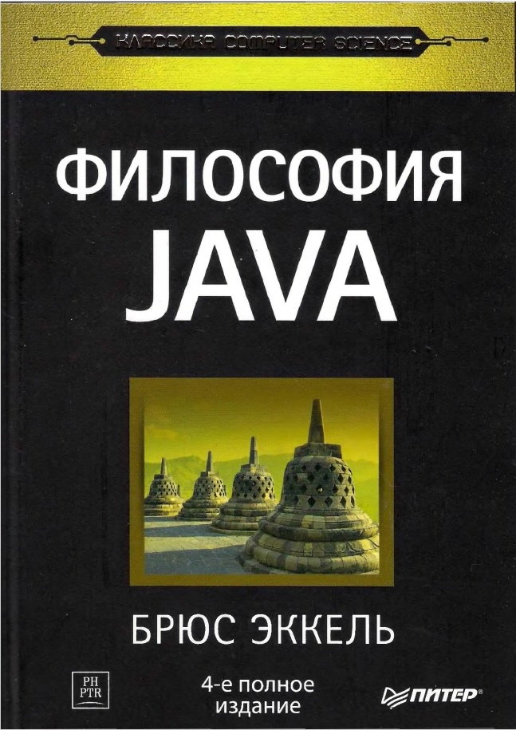

## Java philosophy
-----

*Ссылка на книгу [Ozon.com](https://www.ozon.ru/product/filosofiya-java-142431463/?utm_source=google&utm_medium=cpc&utm_campaign=RF_Regstore_Product_DSA_NewClients&gclid=Cj0KCQjw5PGFBhC2ARIsAIFIMNd2V-VOS6xlzNoQWyuVCnxHO3cnfbFelSDITyz7IQpBZ_HPOJwNxpYaAs4FEALw_wcB)*

Проект по книге Java philosophy 
с моими примерами и комментариями. >:^P

## Другие полезные книги на эту тему
* [Java. Полное руководство | Шилдт Герберт](https://www.ozon.ru/product/java-polnoe-rukovodstvo-145826480/?stat=YW5fMQ%3D%3D)

* [Java. Библиотека профессионала. Том 1. Основы | Хорстманн Кей С.](https://www.ozon.ru/product/java-biblioteka-professionala-tom-1-osnovy-150586176/?stat=YW5fMQ%3D%3D)

* [Изучаем Java | Сьерра Кэти](https://www.ozon.ru/product/izuchaem-java-249166299/?asb=2n4PHOndreUPXAV4BurWORUKxtPN96PWWBSHFs7wlDw%253D&asb2=2n4PHOndreUPXAV4BurWORUKxtPN96PWWBSHFs7wlDw&keywords=java)

